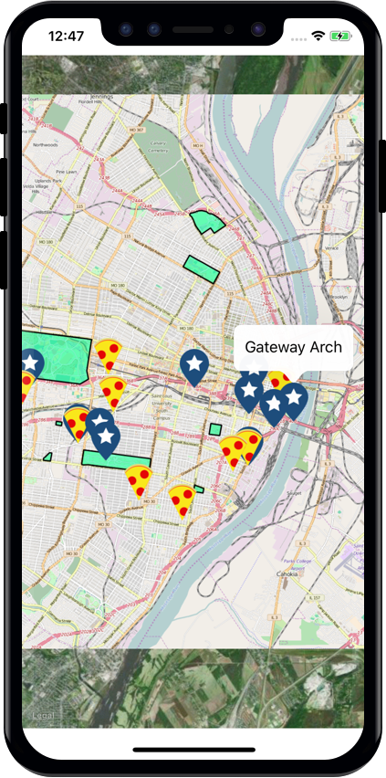

# GeoPackage To Go: Offline Maps from Web to Mobile
## FOSS4G North America 2018 - St. Louis, MO

A [GeoPackage](https://www.geopackage.org/) example using the [GeoPackage iOS library](https://github.com/ngageoint/geopackage-ios) from the session at [FOSS4G](https://2018.foss4g-na.org/session/geopackage-go-offline-maps-web-mobile). There are also examples for [Android](https://github.com/ngageoint/geopackage-android-map/tree/master/docs/examples/kotlin/GeoPackageToGoAndroid) and the [web](https://github.com/ngageoint/geopackage-js/tree/master/docs/examples/GeoPackageToGo).



Disclaimer: Some images appearing in this example app use map layers from [OpenStreetMap](https://www.openstreetmap.org/) or the native platform mapping services from the mobile device. Map layers from native platform mapping services are used in accordance with NGA’s developer license agreement with Apple.

This is a demo application that showcases how you might interact with a GeoPackage on iOS using the GeoPackage iOS Library. The [sample GeoPackage](https://github.com/ngageoint/geopackage-ios/blob/master/docs/examples/swift/GeoPackage-to-go-iOS/GeoPackage-iOS-example/StLouis.gpkg?raw=true) contains some information about pizza shops and points of interest near in the St. Louis area.

Want to learn more? See the full API [documentation] (http://cocoadocs.org/docsets/geopackage-ios/1.3.0/).

### Run

You will need a Mac with Xcode to run this example, iOS device optional as you can use the simulator.

If you haven't already, install [Cocoapods](https://cocoapods.org/) on your machine.

From this directory, in your terminal run:

```
$pod install
```

Open GeoPackage-iOS-example.xcworkspace and click run.


### A note about Swift and Cocoapods

In your projects, if you plan to use the iOS GeoPackage library with [Cocoapods](https://cocoapods.org/) in Swift, you may need to add User Header Search Paths: Pods/** to your target build settings so the bridging header can pick up all of the GeoPackage headers it will need.

You will also need to add this line to the target of your Podfile.

```
use_frameworks!
```

### Code Walkthrough

To view the full example see [ViewController.swift](https://github.com/ngageoint/geopackage-ios/blob/master/docs/examples/swift/GeoPackage-to-go-iOS/GeoPackage-iOS-example/ViewController.swift).

First we grab the GeoPackage out of the app bundle.

```swift
let geoPackagePath:String = Bundle.main.path(forResource:"StLouis", ofType: "gpkg")!
_manager.importGeoPackage(fromPath: geoPackagePath, andOverride: true)
let geoPackage: GPKGGeoPackage = _manager.open("StLouis")
```

Next we query for the tiles, create an overlay, and add it to the map on the main thread.

```swift
// Query Tiles - Do this first so that they tiles display on the bottom
let tiles: NSArray = geoPackage.getTileTables() as NSArray;
let tileTable: String = tiles.object(at: 0) as! String;
let tileDao: GPKGTileDao = geoPackage.getTileDao(withTableName: tileTable);

// Tile Overlay
let tileOverlay: MKTileOverlay = GPKGOverlayFactory.getTileOverlay(with: tileDao);
tileOverlay.canReplaceMapContent = false;

// Add the tile overlay to the map on the main thread, otherwise the tiles wont show up.
DispatchQueue.main.async { [unowned self] in
   self.mapView.add(tileOverlay);
}
```


Now for the features. At the top we loop through the feature tables. We will base the icon for the feature on which table it comes from. After that we loop through the features, once again anytime that data is added to the map it must be done on the main thread. Inside of the DispatchQueue call we set some properties that will be used in our delegate functions to style the annotation and set the text of the popup.

```swift
// Query Features
let features: NSArray = geoPackage.getFeatureTables() as NSArray;
for case let featureTable as String in features {
    let featureDao: GPKGFeatureDao = geoPackage.getFeatureDao(withTableName: featureTable);
    let converter: GPKGMapShapeConverter = GPKGMapShapeConverter(projection: featureDao.projection);
    let featureResults: GPKGResultSet = featureDao.queryForAll();

    var icon = UIImage(named: "poi")
    if (featureTable == "Pizza") {
        icon = UIImage(named: "pizza")
    }

    while (featureResults.moveToNext()) {
        let featureRow: GPKGFeatureRow = featureDao.getFeatureRow(featureResults);
        let geometryData: GPKGGeometryData = featureRow.getGeometry();
        let shape: GPKGMapShape = converter.toShape(with: geometryData.geometry);

        // Add the feature to the map on the main thread, otherwise it wont show up.
        DispatchQueue.main.async { [unowned self] in
            let mapShape = GPKGMapShapeConverter.add(shape, to: self.mapView);

            if (mapShape?.shapeType == GPKG_MST_POINT) {
                let mapPoint:GPKGMapPoint = mapShape?.shape as! GPKGMapPoint
                mapPoint.title = featureRow.getValueWithColumnName("name") as! String
                mapPoint.options.image = icon
            }
        }
    }

    featureResults.close();
}
```

You will need to make your class an MKMapViewDelegate and override two functions. One to handle rendering the tiles and polygons, and the other to style and configure your points on the map.

```swift
func mapView(_ mapView: MKMapView, rendererFor overlay: MKOverlay) -> MKOverlayRenderer {
    var renderer: MKOverlayRenderer = MKOverlayRenderer.init()
    if (overlay is MKPolygon) { // Style the polygons for the park vectors
        let polygonRenderer = MKPolygonRenderer.init(polygon: overlay as! MKPolygon)
        polygonRenderer.fillColor = UIColor.init(red: 0.0, green: 1.0, blue: 0.6, alpha: 0.5)
        polygonRenderer.lineWidth = 1
        polygonRenderer.strokeColor = UIColor.black
        renderer = polygonRenderer
    } else if (overlay is MKTileOverlay) {
        renderer = MKTileOverlayRenderer.init(tileOverlay: overlay as! MKTileOverlay)
    }
    return renderer
}


func mapView(_ mapView: MKMapView, viewFor annotation: MKAnnotation) -> MKAnnotationView? {
    let reuseIdentifier = "pin"
    var annotationView = mapView.dequeueReusableAnnotationView(withIdentifier: reuseIdentifier)

    if (annotation.isKind(of: GPKGMapPoint.classForCoder())) {
        let mapPoint = annotation as! GPKGMapPoint

        if annotationView == nil {
            annotationView = MKAnnotationView(annotation: annotation, reuseIdentifier: reuseIdentifier)
            annotationView?.canShowCallout = true
        } else {
            annotationView?.annotation = annotation
        }

        annotationView?.image = mapPoint.options.image
        annotationView?.centerOffset = mapPoint.options.imageCenterOffset
    }

    return annotationView
}
```

To move the map to where we have data, we get the bounds of the tile layer from the tile DAO and create a coordinate region, and set that region to our map.

```swift
let boundingBox: GPKGBoundingBox = tileDao.getBoundingBox(withZoomLevel: 12)
let transform: GPKGProjectionTransform = GPKGProjectionTransform.init(fromEpsg: PROJ_EPSG_WEB_MERCATOR, andToEpsg: PROJ_EPSG_WORLD_GEODETIC_SYSTEM)
let transformedBoundingBox: GPKGBoundingBox = transform.transform(with: boundingBox)
let region:MKCoordinateRegion = MKCoordinateRegion.init(center: transformedBoundingBox.getCenter(), span: transformedBoundingBox.getSpan())
mapView.setRegion(region, animated: true)
```
